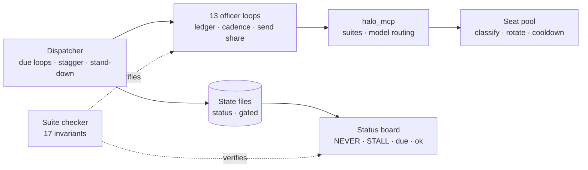

# HALO Ops

**The operations layer under a one-person AI company.** Thirteen scheduled officer loops, one
dispatcher that runs them, an MCP server that routes work to the right model, and a checker that
fails the build when the pieces stop agreeing with each other.

Source is private. This repository is the part worth reading.

## The problem

Unattended agents fail quietly. A model hits its usage limit, exits with status 0 and prints the
apology where the answer should be. A loop goes silent and looks exactly like one that was paused
on purpose. Thirteen command files each claim to follow the same rules, and nobody notices when
two of them stop. None of these throw an error, so each needs something that measures it.

## What it does

| | |
|---|---|
| **Officer loops** | Thirteen scheduled roles (outbound, inbound, funding, security, ops, legal and so on). Each owns a ledger, a cadence and a slice of a shared monthly send budget. |
| **Dispatcher** | Decides which loops are due, staggers them, and publishes its own state so a stopped supervisor is visible in every session. It stands down when the account hits a usage limit instead of firing into the wall. |
| **MCP server** | `halo_mcp` exposes suites (devops, capital, legal and others), each bound to a default model and effort. Claude work rotates across a pool of subscription seats and remembers which are throttled until their stated reset. |
| **Status board** | One script answers "what is running now". Staleness is judged against each loop's own cadence, not a global timeout, and skipped-on-purpose is shown separately from dead. |
| **Suite checker** | Seventeen executable invariants over the command files, the shared contract and the hook: send allocations, cadence, ledger ownership, roster agreement and more. Drift prints what, where and the expected value. |

## How it works

**Exit status is not a signal, so nothing trusts it.** Every Claude result goes through one
classifier that returns `throttled`, `auth`, `error`, `empty` or `ok`. Auth failures are kept apart
from throttling because rotating seats won't fix a dead token and retrying burns the pool.

**Staleness is relative.** A loop that runs hourly is not late at 90 minutes, and one that runs
daily is not healthy at 90 minutes. Three times its own cadence is a dead chain; one to three is
merely due.

**A rule nobody measures is a preference.** The checker exists because an audit found send
allocations summing past the company ceiling, a loop committing under a different prefix than its
twelve siblings, and objection handling owned by four loops. None was visible without reading all
thirteen files side by side.

## Built with

Node.js · Bash · PowerShell · Supabase (pool state) · Docker · Caddy · the Model Context Protocol.

## Read the code

[`excerpts/`](excerpts) has three files from the private source: the result classifier, the two
status precedence ladders, and checks 5 and 10 of the suite checker.

## Status

Built for Dime Data's own operations. The source is private and this repository is
a showcase. © 2026 Dime Data, all rights reserved (see [LICENSE](LICENSE)). Built by
[Dime Data](https://dimedata.cloud).
